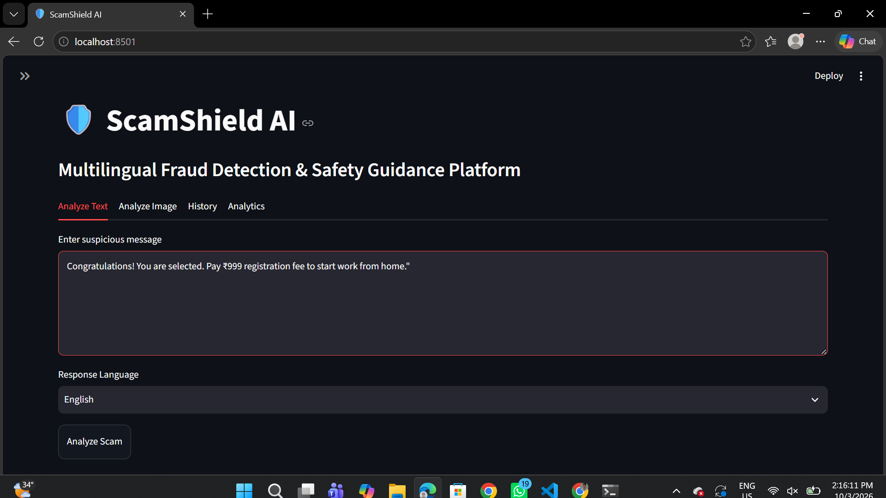
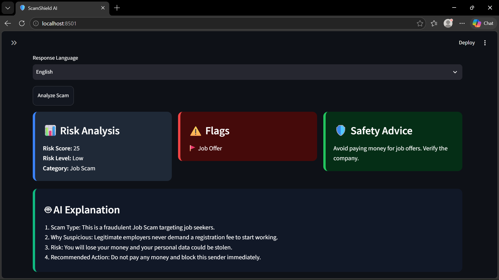
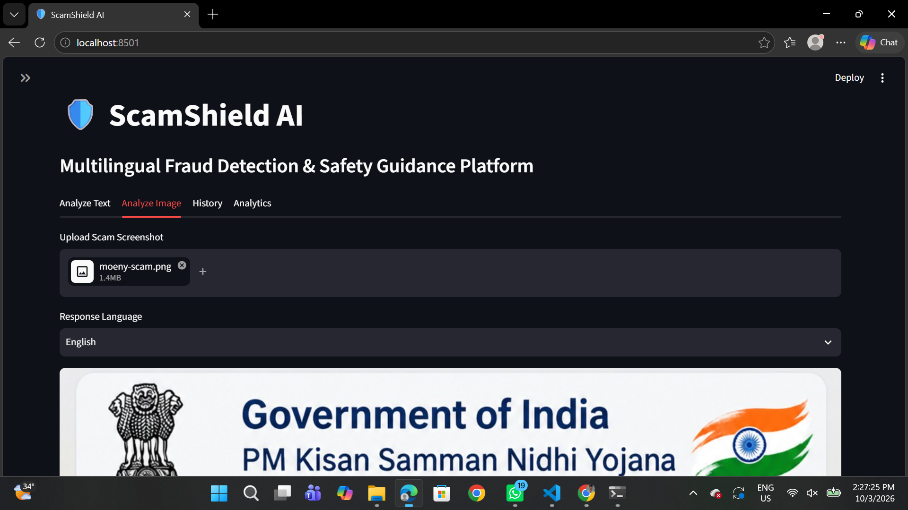
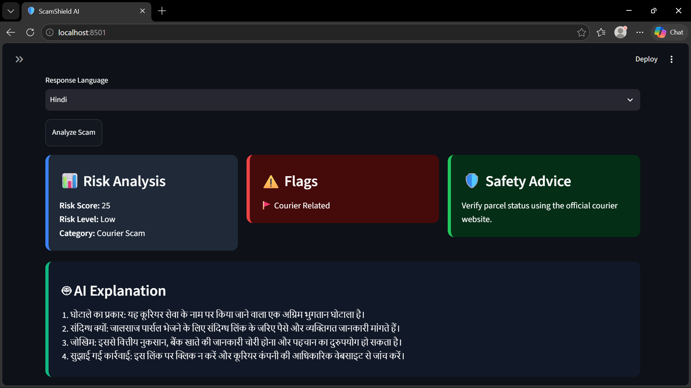
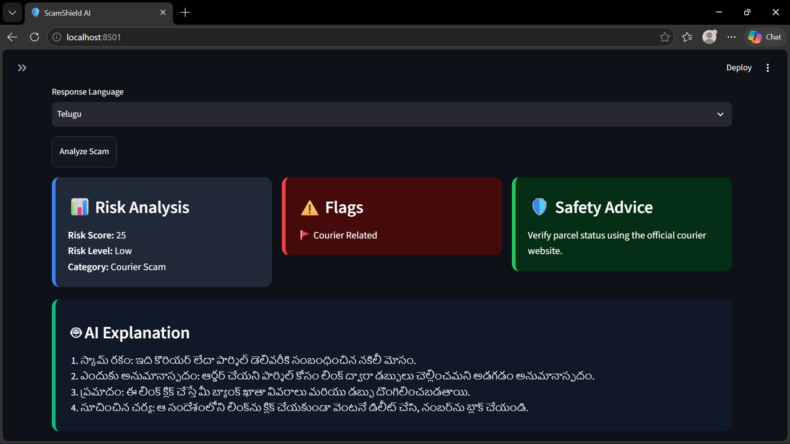
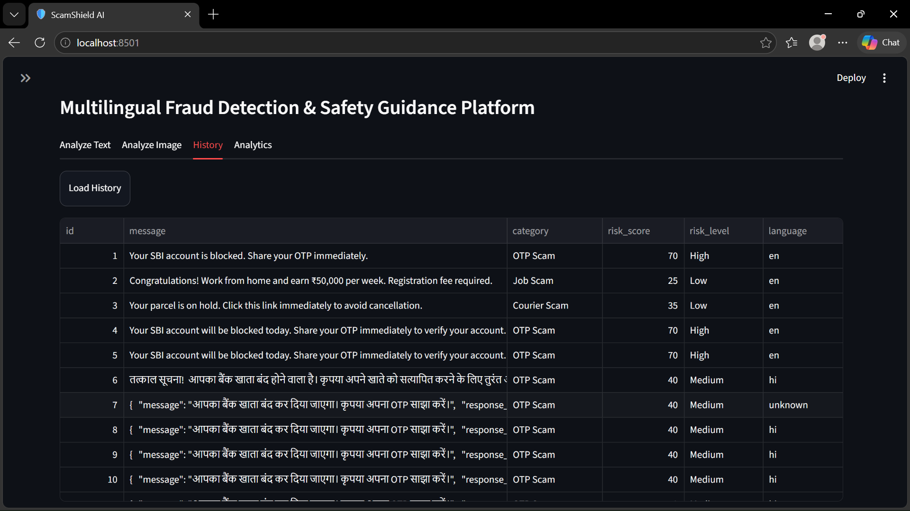
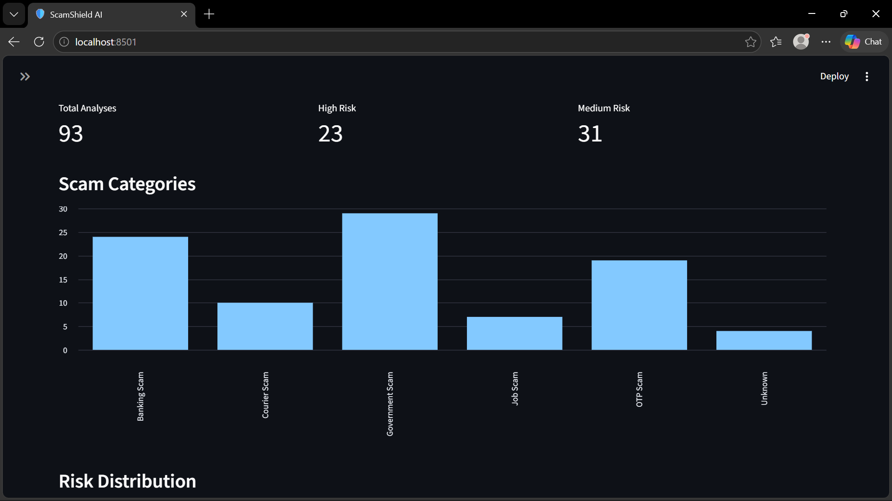
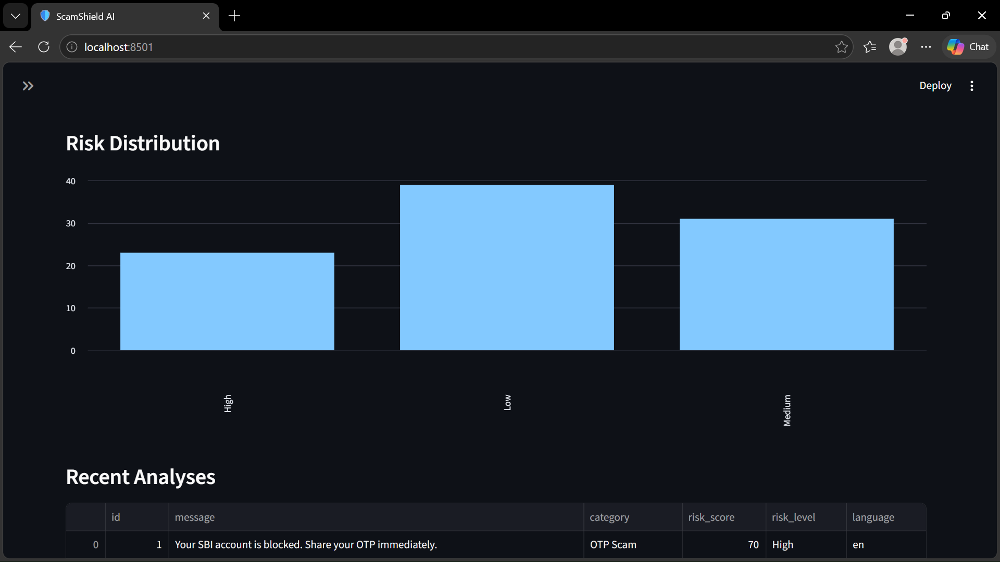

# 🛡️ ScamShield AI

**Multilingual Fraud Detection & Safety Guidance Platform**

ScamShield AI analyses suspicious messages and screenshots, scores their risk, and returns
safety guidance in **English, Hindi, and Telugu**. It is built for users who read the
warning but do not necessarily understand it in English.

A message that says *"Your Aadhaar will be blocked today, call 9876543210 and give OTP"*
is obvious in English. In Telugu, without this tool, it is not. The safety guidance is
returned in the reader's own language and script.

---

## Table of Contents

- [Why This Exists](#why-this-exists)
- [Architecture](#architecture)
- [Tech Stack](#tech-stack)
- [How Detection Works](#how-detection-works)
- [How Multilingual Output Works](#how-multilingual-output-works)
- [Project Structure](#project-structure)
- [Installation](#installation)
- [Running the Project](#running-the-project)
- [Deployment](#deployment)
- [API Reference](#api-reference)
- [Configuration](#configuration)
- [Troubleshooting](#troubleshooting)
- [Limitations](#limitations)
- [Future Work](#future-work)
- [License](#license)

---

---

## 📷 Screenshots

### Homepage



---

### Text Analysis



---

### Image Analysis




---

### Hindi Output



---

### Telugu Output



---

### History



---

### Scam Analytics



---

### Risk Analytics



---

## Why This Exists

Fraud messages in India overwhelmingly target non-English speakers. The threat itself
is language-independent: urgency, an OTP request, an impersonated government or bank,
a phone number to call. But the *defence* is often published only in English.

The consequence is that a warning message is forwarded to a family member, and the
family member cannot verify it. This project closes that gap: the same detection logic,
but the safety guidance comes back in the reader's own language.

---

## Architecture

```
                    ┌──────────────────────────┐
                    │   Streamlit Frontend     │
                    │      (port 8501)         │
                    └────────────┬─────────────┘
                                 │  HTTP / JSON
                                 ▼
                    ┌──────────────────────────┐
                    │    FastAPI Backend       │
                    │      (port 8000)         │
                    └────────────┬─────────────┘
                                 │
     ┌───────────────┬───────────┼───────────┬────────────────┐
     ▼               ▼           ▼           ▼                ▼
┌──────────┐  ┌───────────┐ ┌────────┐ ┌──────────┐  ┌──────────────┐
│  Scam    │  │    RAG    │ │ Gemini │ │   OCR    │  │  LangDetect  │
│ Analyzer │  │  (FAISS)  │ │ Service│ │ EasyOCR  │  │  (langdetect)│
│keywords  │  │ all-Mini  │ │multi-  │ │  en, hi  │  │              │
│+ scoring │  │ LM-L6-v2  │ │ model  │ │          │  │              │
└──────────┘  └───────────┘ └────────┘ └──────────┘  └──────────────┘
     │               │            │          │              │
     └───────────────┴────────────┴──────────┴──────────────┘
                                 │
                          ┌──────┴───────┐
                          │  SQLite DB   │
                          │ (SQLAlchemy) │
                          └──────────────┘
```

**Request flow for `/analyze-text`:**

1. `analyze_message()` scores the message against keyword rules → risk score, level, category, flags
2. `detect_language()` identifies the *input* language via `langdetect`
3. `get_safety_advice()` returns category-specific safety advice
4. The result is persisted to SQLite
5. `generate_explanation()` retrieves one knowledge chunk from FAISS, then calls Gemini with a
   language-specific prompt and returns the 4-point explanation in the requested language
6. FastAPI assembles and returns the combined payload

---

## Tech Stack

| Layer | Technology |
|---|---|
| Frontend | Streamlit 1.62 |
| Backend API | FastAPI 0.141 + Uvicorn |
| LLM | Google Gemini (`google-genai`) |
| Embeddings | `sentence-transformers` → `all-MiniLM-L6-v2` (384-dim) |
| Vector search | FAISS (`IndexFlatL2`) |
| Chunking | `langchain-text-splitters` → `RecursiveCharacterTextSplitter` |
| OCR | EasyOCR (English + Hindi) |
| Language ID | `langdetect` |
| Database | SQLite via SQLAlchemy 2.0 |
| Validation | Pydantic 2.13 |

---

## Project Structure

```
.
├── backend/
│   ├── main.py                     # FastAPI app, all endpoints
│   ├── database/
│   │   ├── db.py                   # Engine, session factory
│   │   └── models.py               # ScamAnalysis table
│   ├── schemas/
│   │   ├── request.py              # AnalyzeRequest
│   │   ├── response.py             # AnalyzeResponse
│   │   └── stats_response.py
│   └── services/
│       ├── scam_analyzer.py        # Keyword risk engine
│       ├── gemini_service.py       # Multilingual explanation + failover
│       ├── faiss_service.py        # Vector index load/search
│       ├── embedding_service.py    # all-MiniLM-L6-v2 embeddings
│       ├── chunking_service.py     # Recursive text splitter
│       ├── language_service.py     # langdetect wrapper
│       ├── ocr_service.py          # EasyOCR extraction
│       ├── safety_advice.py        # Category advice lookup
│       ├── similarity_service.py
│       └── rag_service.py
├── frontend/
│   └── app.py                      # Streamlit UI (4 tabs)
├── scripts/
│   └── build_vector_db.py          # Rebuild the FAISS index
├── data/
│   ├── scam_knowledge/             # 6 knowledge documents
│   └── vector_store/               # Generated: index + chunks
├── tests/
├── docs/screenshots/
├── .streamlit/config.toml          # Streamlit Cloud config
├── render.yaml                     # Render blueprint for the API
├── runtime.txt                     # Pinned Python for Render
├── requirements.txt                # Frontend deps only
├── requirements-backend.txt        # Full backend deps
├── README.md
└── .env                            # Local only — never commit
```


## 🎯 How It Works

1. User enters a suspicious message or uploads a screenshot.
2. EasyOCR extracts text from images.
3. Scam Detection Engine identifies scam indicators.
4. FAISS retrieves relevant fraud knowledge.
5. Gemini AI generates multilingual explanations.
6. Risk score, scam category, and safety advice are displayed.


## Installation

**Prerequisites:** Python 3.11

```bash
git clone <your-repo-url>
cd Multilingual_Fraud_Detection_Safety_Guidance_Platform

python -m venv .venv
.venv\Scripts\activate          # Windows
# source .venv/bin/activate     # macOS / Linux

pip install -r requirements.txt 
```

Create `.env` in the project root:

```bash
GEMINI_API_KEY=your-key-here
```

Get a key at [Google AI Studio](https://aistudio.google.com/apikey).

**Build the vector index** (required once, otherwise RAG retrieval returns nothing):

```bash
python scripts/build_vector_db.py
```

> `data/vector_store/` is excluded by `.gitignore` because it is a generated binary
> artifact. Run this script after cloning. If you prefer to ship a prebuilt index,
> remove that line from `.gitignore`.

---

## Running the Project

Two processes are required. Open two terminals.

**Terminal 1 — backend:**

```bash
uvicorn backend.main:app --reload --port 8000
```

**Terminal 2 — frontend:**

```bash
streamlit run frontend/app.py
```

Open <http://localhost:8501>.

| Tab | Function |
|---|---|
| Analyze Text | Paste a message, choose response language, get risk analysis + multilingual explanation |
| Analyze Image | Upload a scam screenshot, extract text via OCR, analyse it in the chosen language |
| History | View all past analyses from SQLite |
| Analytics | Aggregated metrics, category distribution, risk distribution |

---

## API Reference

| Method | Endpoint | Description |
|---|---|---|
| `GET` | `/` | Service banner |
| `GET` | `/health` | Liveness check |
| `POST` | `/analyze-text` | Analyse a text message |
| `POST` | `/analyze-image` | Analyse an uploaded image |
| `GET` | `/history` | All stored analyses |
| `GET` | `/analytics` | Aggregate statistics |

**`POST /analyze-text`**

```json
{
  "message": "Your Aadhaar will be blocked today. Call 9876543210 and give OTP.",
  "response_language": "Telugu"
}
```

`response_language` is one of `English`, `Hindi`, `Telugu`. Defaults to `English`.

Response:

```json
{
  "risk_score": 65,
  "risk_level": "Medium",
  "category": "Government Scam",
  "flags": ["OTP Request", "Government Related"],
  "language": "en",
  "advice": "Never share OTPs with anyone...",
  "explanation": "1. స్కామ్ రకం: ..."
}
```

**`POST /analyze-image`**

Multipart form with a `file` field, plus an optional query parameter:

```
POST /analyze-image?response_language=Hindi
```

Returns `{ "extracted_text": "...", "analysis": { ... } }`.

---

## Configuration

| Variable | Where | Required | Default | Purpose |
|---|---|---|---|---|
| `GEMINI_API_KEY` | both | Yes | — | Google Gemini API key |
| `GEMINI_MODEL` | backend | No | `gemini-3.5-flash` | Preferred model, prepended to the failover chain |
| `API_URL` | frontend | No | `http://127.0.0.1:8000` | Backend base URL. Required for deployment |
| `CORS_ORIGINS` | backend | No | `*` | Comma-separated allowed origins |

---


## 💡 Key Learning Outcomes

- FastAPI Backend Development
- Streamlit Application Development
- OCR Integration
- Retrieval-Augmented Generation (RAG)
- Vector Search using FAISS
- Google Gemini API Integration
- Multilingual AI Applications
- SQLite Database Management

---  
## Troubleshooting

**Streamlit shows "API unreachable".**

Expected during a Render cold start (2–5 minutes). If it persists, open
`/health` on your Render URL directly in a browser. If that fails, check the Render logs.

**"Failed to deploy: could not install requirements".**

`requirements.txt` must stay minimal (streamlit, requests, pandas). The heavy backend
dependencies belong in `requirements-backend.txt`. If torch or faiss appear in
`requirements.txt`, Streamlit Cloud will try to install ~2 GB and time out.

**All output suddenly looks generic or repetitive.**

You have hit the API quota. The app silently falls back to its built-in templates, which
are correct in each language but not message-specific. The tell-tale sign is the literal
string `Government Scam` appearing inside the Telugu explanation. Free-tier limits are
20 requests/day *per model*; across the six models in the chain that is roughly 120
requests/day. Limits reset daily. Enable billing to remove them.

**Explanation is cut off after point 2.**

A model is running with thinking enabled. Confirm the running code includes
`thinking_budget=0` in `backend/services/gemini_service.py`.

**`400 INVALID_ARGUMENT` in the terminal.**

A flash-lite model received `thinking_config`, which it rejects. Lite models are listed
in `LITE_MODELS` and must build their config without that field.

**`404` on `gemini-2.5-pro`.**

That model is no longer available to new API keys; Google returns a redirect notice to
`gemini-3.1-pro-preview`. Remove it from the chain.

**Streamlit page loads but every button errors.**

The backend is not running on port 8000. Both processes are required.

**`IndexError` in `faiss_service.py` on first run.**

The vector index has not been built. Run `python scripts/build_vector_db.py`.

---

## Limitations

Stated plainly, because they are real:

- **Keyword detection is shallow.** It matches on substrings, so it can be evaded and can
  produce false positives. It is not a classifier and should not be presented as one.
  False negatives on novel scam phrasing are expected.
- **OCR handles English and Hindi only.** EasyOCR is configured for `['en', 'hi']`, so
  Telugu text in a screenshot will not be extracted. Telugu *output* is unaffected.
  EasyOCR is also the heaviest dependency on the backend and the most likely cause of
  memory pressure on a small cloud instance.
- **Risk scoring is additive and unweighted.** A message matching both OTP and government
  keywords is not scored more dangerously than one matching only OTP, unless a further
  signal fires.
- **`ScamAnalysis.message` is a `String` column with no length limit.** SQLite permits
  this, but a different database would require a `Text` column.
- **No authentication.** Every endpoint is open. On a public deployment this means anyone
  can call `/analyze-text` and generate API cost against your key, and can read your entire
  analysis history. Restrict at minimum with a shared token in `CORS_ORIGINS` plus a
  reverse proxy, or keep the API private.
- **No prompt-injection defence.** A scam message containing instruction-like text is
  passed into the Gemini prompt. The output is constrained to a fixed four-line format and
  is not executed anywhere, which limits impact, but the message content is not
  neutralised before prompting.
- **SQLite is synchronous and global.** Fine for a single-user demo; not concurrent-safe
  for production traffic.

---

## Future Work

- Telugu OCR support
- Replace the keyword engine with a trained classifier, keeping the rule engine as an
  interpretable baseline
- Expand the knowledge base beyond six documents
- Per-user history and rate limiting
- WhatsApp and SMS ingestion
- Add a real automated test suite (`pytest` is not currently installed)

---

## 🛡️ License

This project is licensed under the [MIT License](LICENSE).

---

## 🤝 Contributing

Contributions, issues, and feature requests are welcome! Feel free to check the [issues page]

---

## Acknowledgements

- Google Gemini API for multilingual generation
- `sentence-transformers` and the `all-MiniLM-L6-v2` model
- FAISS for vector similarity search
- EasyOCR for screenshot text extraction
